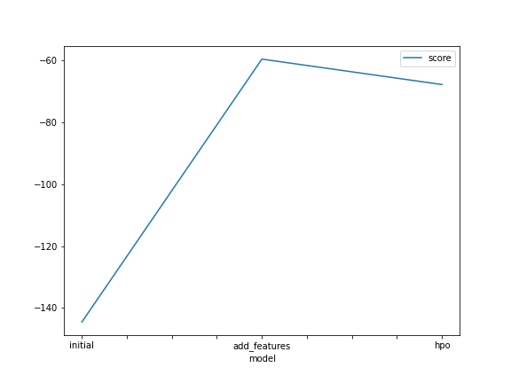

# Report: Predict Bike Sharing Demand with AutoGluon Solution
#### Guilherme Lawnrence Rebouças Oliveira

## Initial Training
### What did you realize when you tried to submit your predictions? What changes were needed to the output of the predictor to submit your results?
Beacause of the regression characteristics of the model, some predictions were slightly negatives.

### What was the top ranked model that performed?
The last one that was not only considering new features but also using non-defalt parameters

## Exploratory data analysis and feature creation
### What did the exploratory analysis find and how did you add additional features?
Analysing the data is possible to identify some behaviour that is spacific to the day of the week, so i tried adding this information as a new feature to the model.

### How much better did your model preform after adding additional features and why do you think that is?
It performed much better, decreassing by almost half the score on kaggle. It happened beacause people usualy demand bikes on the same weekdays.

## Hyper parameter tuning
### How much better did your model preform after trying different hyper parameters?
TODO: Marginaly Better.

### If you were given more time with this dataset, where do you think you would spend more time?
Yes.

### Create a table with the models you ran, the hyperparameters modified, and the kaggle score.
|model|presets|time_limit| NN_TORCH |score|
|--|--|--|--|--|
|initial|best_quality|60|defalts|1.30209|
|add_features|best_quality|60|defalts|0.72863|
|hpo|best_quality|60|num_epochs = 10| 0.59377|

### Create a line plot showing the top model score for the three (or more) training runs during the project.

TODO: Replace the image below with your own.

### Create a line plot showing the top kaggle score for the three (or more) prediction submissions during the project.

TODO: Replace the image below with your own.

## Summary
TODO: Add your explanation